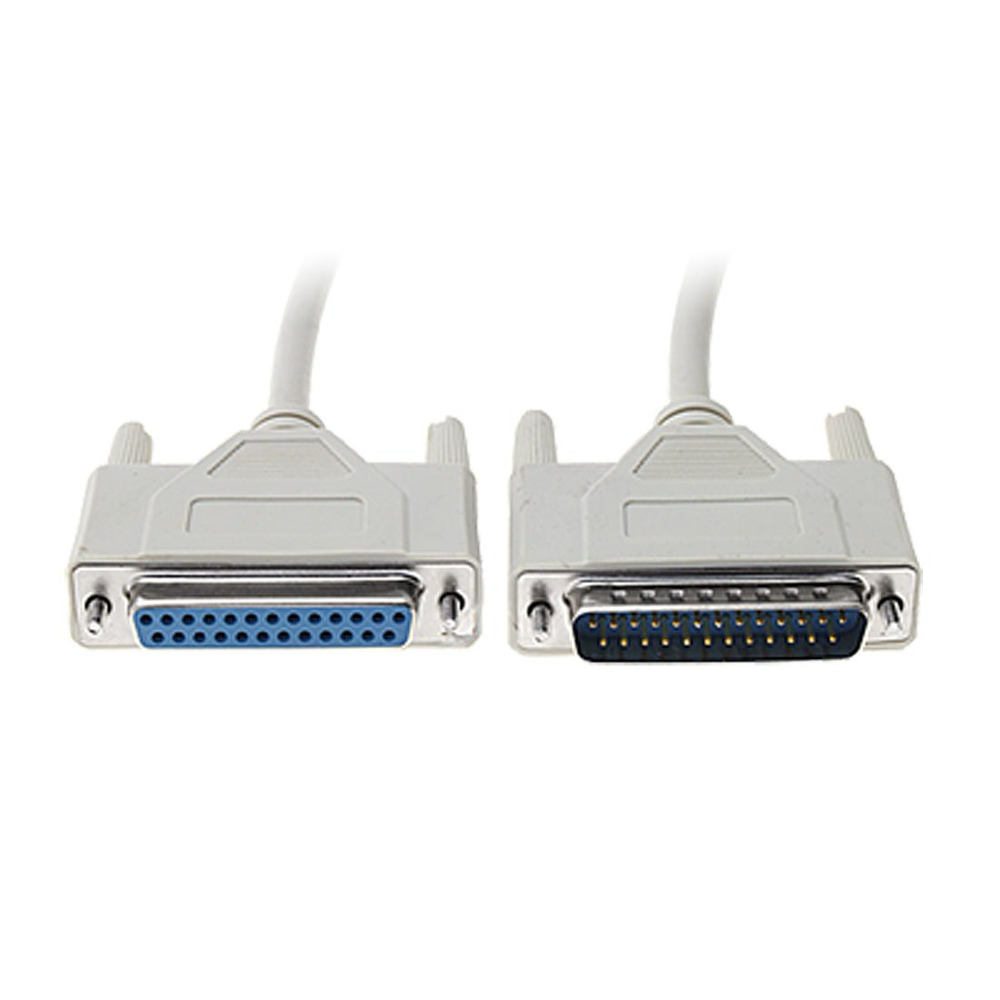

# Digital Triggers for Psychological Experiments

This guide explains how digital triggers work in experimental psychology setups, particularly for synchronizing stimulus presentation with physiological data recording.

## Table of Contents
- [Introduction](#introduction)
- [Hardware Setup](#hardware-setup)
  - [Experimental Setup](#experimental-setup)
  - [Parallel Ports](#parallel-ports)
  - [Connecting Parallel Ports](#connecting-parallel-ports)
  - [Pins & Bits](#pins--bits)
  - [Mapping Lines to Experiment Status](#mapping-lines-to-experiment-status)
  - [Overlapping Triggers vs 'Blips'](#overlapping-triggers-vs-blips)
- [Encoding Triggers](#encoding-triggers)
  - [Base-10](#base-10)
  - [Binary](#binary)
  - [Hex](#hex)
  - [Bitmasking](#bitmasking)
- [Programming](#programming)
  - [PsychoPy](#psychopy)
- [Further Reading](#further-reading)
- [Research](#research)

## Introduction

Digital triggers are recordings of when events occur in your experiment - for example, the exact moment a stimulus appears on screen. Due to various factors (including computer processing load), the recorded time of stimulus presentation may differ slightly from when it actually appeared. This can affect data analysis, especially when aligning EEG signals (which are measured thousands of times per second) with stimulus presentation. This guide explains techniques to make trigger timing as accurate as possible.

## Hardware Setup

### Experimental Setup

Typical setups requiring digital triggers may include:
- 1-2 computers
- A recording device (EEG cap/headset, skin-conductance or ECG electrodes)
- Connecting cables

Researchers often use two computers to maximize accuracy:
- One computer records physiological data (e.g., EEG using AcqKnowledge or CGX Acquisition)
- Another displays stimuli and records participant responses (using Psychopy, Inquisit, E-Prime, etc.)

In such setups, information about the experiment status (onset/offset of stimuli, beginning/end of blocks/trials) must be sent to the physiology recording computer. To align this information as precisely as possible, it's typically passed through the physiology recording hardware.

### Parallel Ports

Traditionally, psychologists used parallel ports (found on the back of older computers) to send information between computers. Even if your current setup transfers information via USB or wirelessly, it likely mimics parallel ports at the software level. Understanding these ports helps explain why the software functions as it does. Additionally, the connection to the physiology equipment often still uses a parallel port.

### Connecting Parallel Ports

**Note**: Not all parallel port cables are interchangeable. The cables used are technically DB-25 connectors. For example, Biopac uses a proprietary pin configuration - the required cable for MP35/MP36 (STP35A or B) can be found [here](https://www.biopac.com/product/usb-ttl/).

If you need to connect a parallel port to a modern computer:
- The USB TTL module from BBTK can act as a USB adapter: [BlackBoxToolkit USB TTL Module](https://www.blackboxtoolkit.com/usbttl.html) (gender changer sold separately)
- Software available at: [BlackBoxToolkit Support](https://www.blackboxtoolkit.com/support_usb_ttl_module.html)
- Biosemi also offers a USB to parallel port cable: [Biosemi USB Trigger Interface Cable](https://www.biosemi.com/faq/USB%20Trigger%20interface%20cable.htm)

### Pins & Bits

Parallel port cables have multiple pins serving different functions. The pins labeled 'D0' to 'D7' are the channels we use to send triggers. These pins are the endpoints of separate wires running through the cable. Information is sent by turning them either on (electricity running through) or off (no electricity).

We instruct the computer to send electricity down these wires using strings of eight 1s or 0s, corresponding to which lines should be on or off. For example, to turn on lines 1, 2, and 4, we send '00001011'. We can later send '00000001' to turn lines 2 and 4 off while keeping line 1 open. Information for all pins must typically be sent simultaneously (hence "parallel" port).

### Mapping Lines to Experiment Status

Sending on/off signals (1 or 0) across 8 (sometimes 16) different lines or channels provides the medium for transmitting information from our experimental setup. While seemingly restrictive, this is sufficient for most experimental purposes. A common setup might use:
- Line 1 to indicate start/end of a block or trial
- Line 2 for start/end of stimulus A presentation
- Line 3 for stimulus B, etc.

### Overlapping Triggers vs 'Blips'

There are two main approaches to using these lines:
1. **Overlapping triggers**: Turn lines on at the start of an event and off at the end, which may result in overlapping signals (one line remains open while others turn on/off)
2. **Blips** (or pulses): Turn a line on very briefly and then off again, creating a spike in the recording to mark the event

When using the pulse/blip method, a small delay (typically 0.001 seconds) is needed for the computer to reliably detect this brief change. This is handled by pausing program execution for that duration.

## Encoding Triggers

Most software won't require you to directly input binary sequences of 1s and 0s. Instead, they use numbers in various formats:
- Cedrus' Pyxid package allows you to specify line numbers to open/close
- The pySerial package (used by PsychoPy) often uses Hex codes
- Received data may list opened/closed line numbers or use an encoded number

### Base-10

We typically count in base-10, using numbers 0-9 and progressively storing groups of 10 in the left digit. For example, after 9 comes 10, storing one group of 10 and starting back at 0 in the right digit. When adding 1 to 99, both digits reset to 0 and a 1 is added on the left to represent 10 groups of 10.

There's nothing inherently natural about base-10; some cultures have used base-12 or even base-60 (which is why clocks use 60 seconds/minutes and 12 hours).

### Binary

Computers "think" in binary (base-2), using only 1s and 0s. Counting follows the same principle as base-10 but with only two digits: counting to the highest available digit (1), then storing that value on the left and adding another digit. To count from 0-7 in binary: 0, 1, 10, 11, 100, 101, 110, 111.

These numbers are left-padded with 0s to create 8-digit sequences. For example, '01000000' or '10000000' activate lines 7 or 8 respectively, and can be encoded as decimal values (64 and 128).

### Hex

Binary can be cumbersome for humans to work with directly. Hexadecimal (base-16 or "hex") provides a more compressed format. Hex uses numbers 0-9 plus letters A-F (representing values 10-15). This can be confusing: F=15, 10=16, and FF=255. However, it's a common format for sending triggers with PsychoPy using commands like `port.write('F1'.encode())`.

### Bitmasking

The codes sent to acquisition software might be the opposite of what you'd expect. For example, with Pyxid and CGX Acquisition:
- Activating line 1 shows as '1' ('00000001' in binary)
- Closing that line sends 254 ('11111110')
- Opening line 4 shows as '8' ('00001000')
- Closing line 8 shows as 247 ('11110111')

This process is called "bitmasking" - comparing one binary number with another to produce a final binary outcome. In these examples, a logical AND operation is performed on the input values.

## Programming

Regardless of your programming language or software, you'll need to specify which port your device is connected to. To find the correct COM port on Windows, open Device Manager and expand "Ports (COM & LPT)". If unsure which one is your device, unplug and reconnect it to identify the changing entry.

### PsychoPy

There are two main Python packages for sending triggers:
- [PySerial](https://pyserial.readthedocs.io/en/latest/) (most common)
- [PyXid2](https://github.com/cedrus-opensource/pyxid) (popular for certain proprietary products)

For a tutorial on sending triggers in PsychoPy using PySerial, see: [PsychoPy Serial Port Instructions](https://psychopy.org/hardware/serialPortInstr.html)

Additional notes:
- The builder component may have issues; consider using a custom code block instead
- To detect when components are displayed/hidden, check `name_of_component.status == STARTED`, `NOT_STARTED`, or `FINISHED`. Sound components also use `.isPlaying`
- For delayed triggers, use `my_clock = core.Clock()` in 'begin routine', and check `my_clock >= 3.5` in 'each frame'
- For triggers at block start/end, refer to `name_of_loop.thisTrialN` in 'Begin Routine' or `name_of_loop.nRemaining` in 'End Routine'
- When using blips/pulses, use `core.wait(0.001)` to delay execution before turning the line off. Be cautious when closing one line and immediately opening another

## Further Reading

- [Brain Products Triggers Tutorial](https://pressrelease.brainproducts.com/trigger-beginners-guide/)
- [Psychopy Pyxid2 & Biosemi USB adapter tutorial for EEG study](https://github.com/drmarcj/psychopy_biosemi_serial)

## Research

- [Frontiers in Neuroinformatics article](https://www.frontiersin.org/journals/neuroinformatics/articles/10.3389/fninf.2020.00002/full)
- [BIOPAC Stimulation Response Analysis Software Module](https://www.biopac.com/product/stimulation-response-analysis-software-module/)
- Lab Streaming Layer (LSL):
  - [LSL Documentation](https://labstreaminglayer.readthedocs.io/info/intro.html)
  - [BioRxiv Paper](https://www.biorxiv.org/content/10.1101/2024.02.13.580071v1)
  - [Brain Products Tips and Tricks for LSL](https://www.brainproducts.com/support-resources/tips-and-tricks-for-lsl/)
  - [YouTube Tutorial](https://www.youtube.com/watch?v=Y1at7yrcFW0)
- [BBTK paper: Self-validating presentation and response timing in cognitive paradigms](https://www.researchgate.net/publication/8358738_Self-validating_presentation_and_response_timing_in_cognitive_paradigms_How_and_why)
